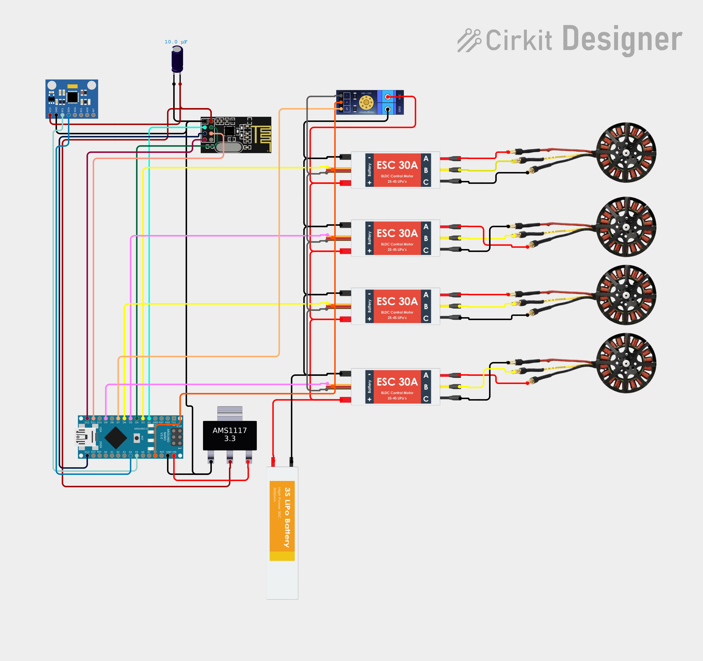
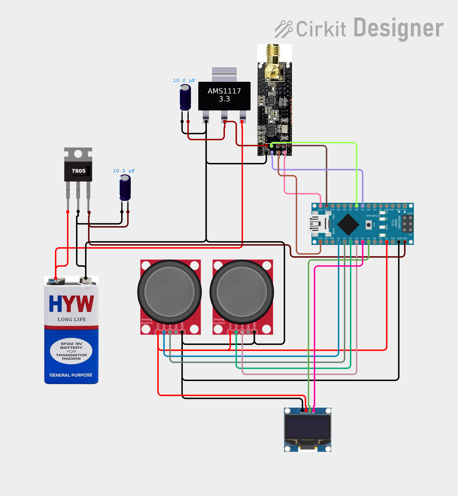

# Quadcopter Control System

A complete Arduino-based quadcopter flight control system with wireless remote control and real-time telemetry.

## Overview

This project implements a fully functional quadcopter control system using Arduino NANO microcontrollers. The system consists of two main components:

- **Receiver Unit** (`receiver.ino`) - Mounted on the quadcopter, handles flight stabilization, sensor data processing, and motor control
- **Transmitter Unit** (`transmitter.ino`) - Handheld remote controller with joystick inputs and OLED display

## Key Features

### Flight Control

- **PID-based stabilization** with roll, pitch, and yaw control
- **MPU6050 IMU integration** for attitude estimation using complementary filtering
- **Motor control** via ESCs for 4-motor X-configuration quadcopter
- **Height estimation** using accelerometer data integration

### Wireless Communication

- **nRF24L01** radio modules for reliable 2.4GHz communication
- **Real-time telemetry** transmission (battery voltage, height data)
- **Bidirectional data exchange** between transmitter and receiver

### User Interface

- **4-axis joystick control** (throttle, roll, pitch, yaw)
- **SSD1306 OLED display** showing battery status and flight data
- **Animated startup sequence** with system initialization

### Safety Features

- **Battery voltage monitoring** with percentage calculation
- **Integral windup protection** in PID controller
- **Motor safety cutoffs** at low throttle
- **Angle limiting** to prevent excessive tilting

## Hardware Requirements

### Receiver (Quadcopter)

- Arduino NANO
- nRF24L01 module
- 1000 kV BLDC motor x4
- 30A ESC x4
- 9" Propeller x4
- 1117 IC
- 3s Li-po battery (12V, 2200mAh)  
- XT60 connector
- MPU6050 gyroscope accelerometer module
- Voltage sensor
- 10 μF Capacitor
- Zero PCB board
- Aluminum tube (for frame)

### Transmitter (Remote)

- Arduino NANO
- nRF24L01 + PA module
- 1117 IC
- 7805 IC
- OLED display
- Battery connector
- 9V battery
- Zero pcb board
- Joystick module x2
- 10 μF capacitor x2

## Circuit

### Receiver

### Transmitter

## Getting Started

1. Upload `receiver.ino` to the quadcopter's Arduino
2. Upload `transmitter.ino` to the remote controller's Arduino
3. Ensure proper wiring according to pin definitions in code
4. Power on transmitter first, then receiver
5. Calibrate the system before first flight

## Important Notes

- **Calibration required** - Keep quadcopter stationary during gyroscope calibration
- **Safety first** - Always test in controlled environment
- **Battery monitoring** - Monitor voltage levels to prevent over-discharge

## Documentation

For detailed technical specifications, circuit diagrams, implementation details, and performance analysis, please refer to:

**`Project Report - Quadcopter Major Project.pdf`**

## License

This project is provided as-is for educational and experimental purposes.
