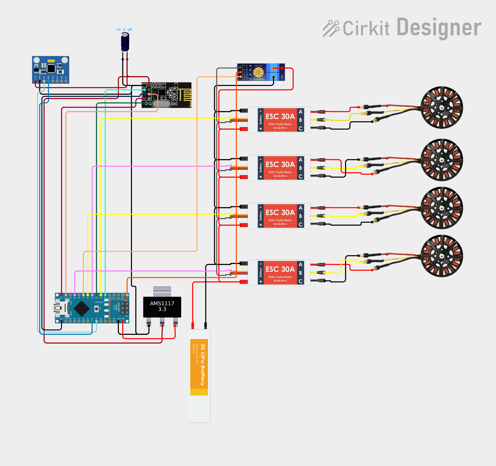
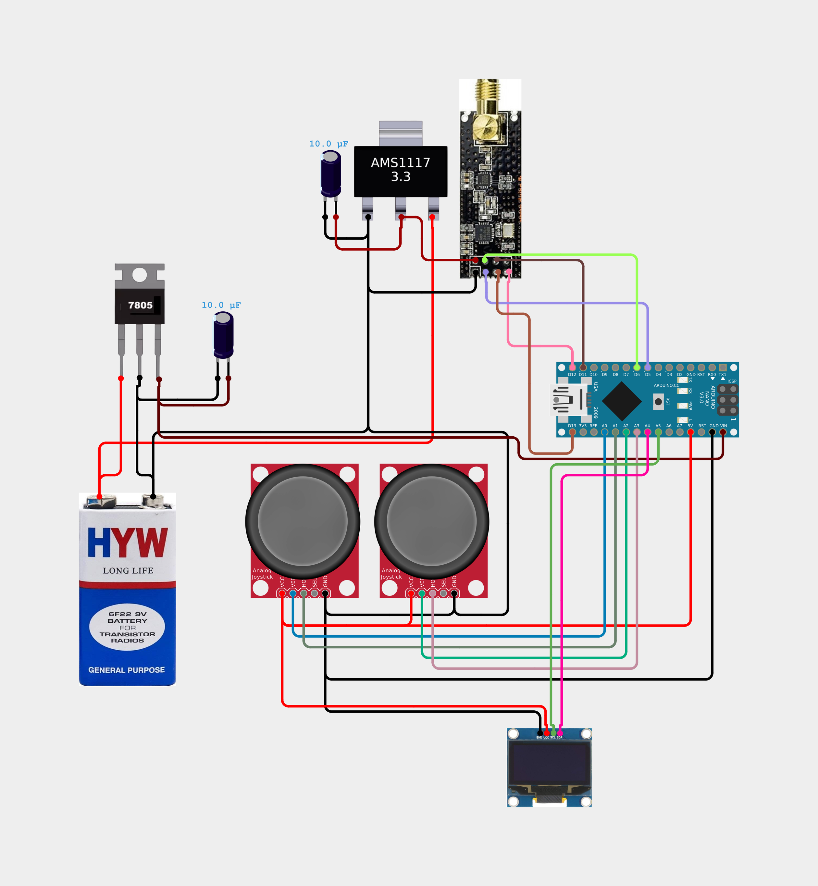

# Quadcopter Control System

A complete MCU-based quadcopter flight control system with wireless remote control and real-time telemetry.

## Table of Contents
- [Overview](#overview)
- [Usage and Licensing](useage-and-licensing)
- [How it Started](how-it-started)
- [How to Build](how-to-build)
- [Key Features](#key-features)
- [Hardware Requirements](#hardware-requirements)
- [Circuit](#circuit)
- [Important Notes](#important-notes)

## Overview

This project implements a fully functional quadcopter control system using Arduino NANO microcontrollers. The system consists of two main components:

- **Receiver Unit** (`receiver.ino`) - Mounted on the quadcopter, handles flight stabilization, sensor data processing, and motor control
- **Transmitter Unit** (`transmitter.ino`) - Handheld remote controller with joystick inputs and OLED display

## Usage and Licensing

**This project licensed under GNU GPL-3.0**

You may use it, copy it, modify it, republish it, but you need to keep it open and published verbatim under GNU GPL-3.0

## How it Started

This started as a college group project by [**Shantom Gayen**](https://github.com/ShantomGayen), **Rakesh Bhowmik**, [**Shibjyoti Das**](https://github.com/Shibjyoti555), **Sanjit Saren**, **Dip Ghosh**, **Sayan Biswas**, **Anuva Bhattacharya**, and **Pranab Mondal**. We then decided to open it to the world, hoping it reaches people like you, who can use it, learn from it, and help improve it.

## How to Build

Circuit diagrams of the transmitter and receiver are in [`/circuit`](/circuit) as `circuit/dronetx.png` and `circuit/dronerx.png` respectively.
Assemble as given, and upload [`transmitter/transmitter.ino`](transmitter/transmitter.ino) to the Arduino NANO on the transmitter, and [`receiver/receiver.ino`](receiver/receiver.ino) to the Arduino NANO on the receiver.

> 📌 **REMEMBER:** Use a light-weight frame (**aluminum recommended**).
> Plastic frames or any other low elastic material may cause the quadcopter to vibrate mid-flight

## Key Features

### Flight Control

- **PID-based stabilization** with roll, pitch, and yaw control
- **MPU6050 IMU integration** for attitude estimation using complementary filtering
- **Motor control** via ESCs for 4-motor X-configuration quadcopter
- **Height estimation** using accelerometer data integration

### Wireless Communication

- **nRF24L01** radio modules for reliable 2.4GHz communication
- **Real-time telemetry** transmission (battery voltage, height data)
- **Bidirectional data exchange** between transmitter and receiver

### User Interface

- **4-axis joystick control** (throttle, roll, pitch, yaw)
- **SSD1306 OLED display** showing battery status and flight data
- **Animated startup sequence** with system initialization

### Safety Features

- **Battery voltage monitoring** with percentage calculation
- **Integral windup protection** in PID controller
- **Motor safety cutoffs** at low throttle
- **Angle limiting** to prevent excessive tilting

## Hardware Requirements

### Receiver (Quadcopter)

- Arduino NANO
- nRF24L01 module
- 1000 kV BLDC motor x4
- 30A ESC x4
- 9" Propeller x4
- 1117 IC
- 3s Li-po battery (12V, 2200mAh)  
- XT60 connector
- MPU6050 gyroscope accelerometer module
- Voltage sensor
- 10 μF Capacitor
- Zero PCB board
- Aluminum tube (for frame)

### Transmitter (Remote)

- Arduino NANO
- nRF24L01 + PA module
- 1117 IC
- 7805 IC
- OLED display
- Battery connector
- 9V battery
- Zero pcb board
- Joystick module x2
- 10 μF capacitor x2

## Circuit

### Receiver

### Transmitter

## Important Notes

- **Calibration required** - Keep quadcopter stationary during gyroscope calibration
- **Safety first** - Always test in controlled environment
- **Battery monitoring** - Monitor voltage levels to prevent over-discharge
